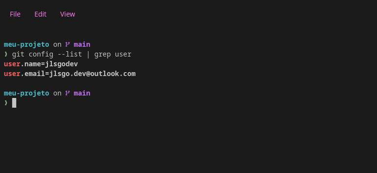
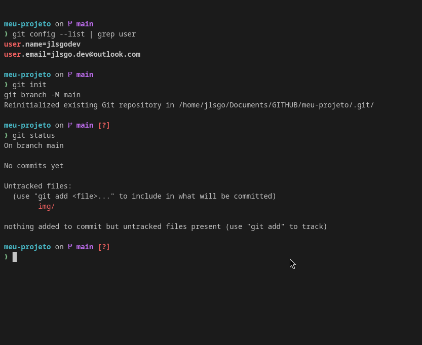
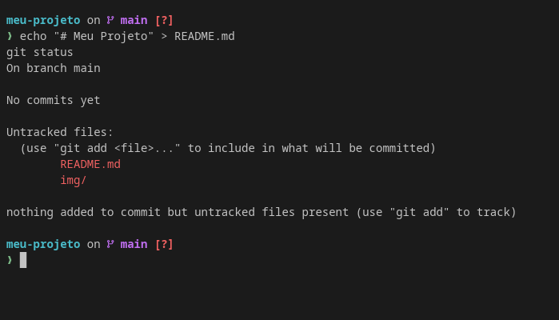
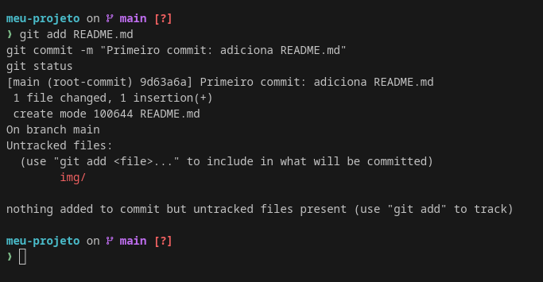
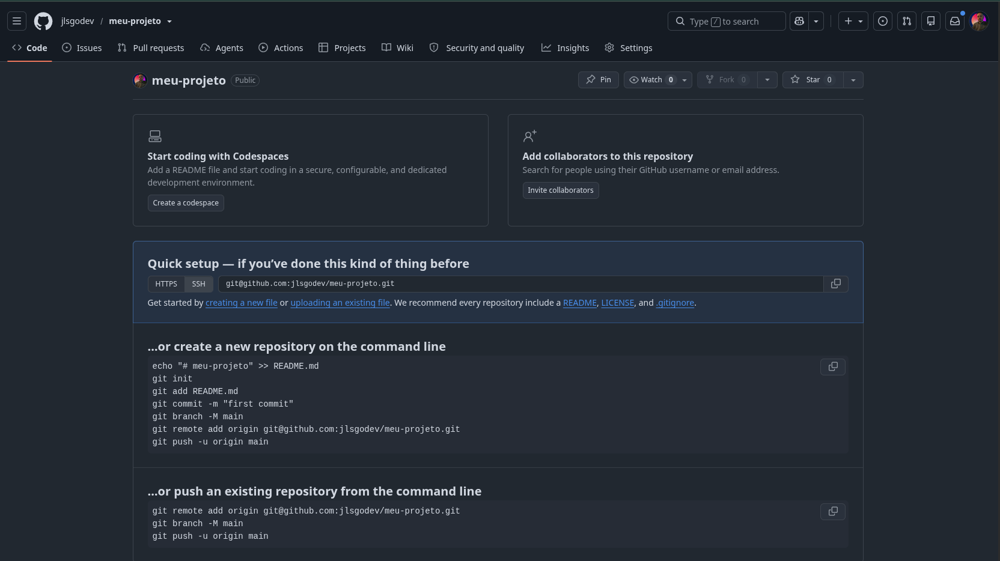
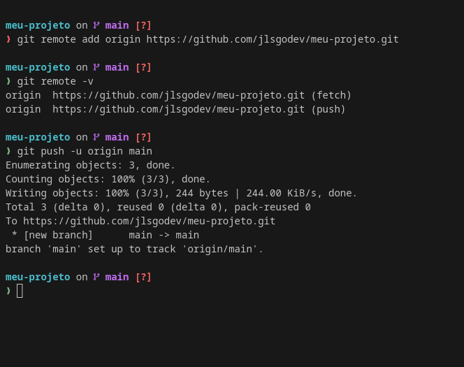
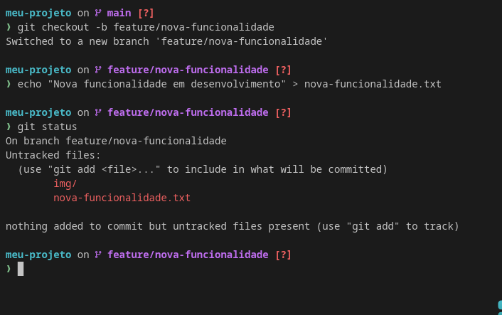
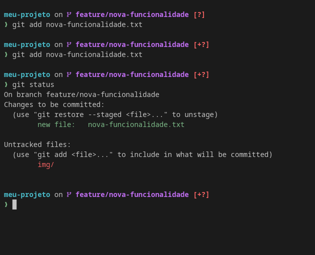
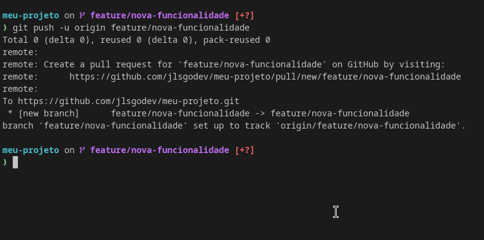
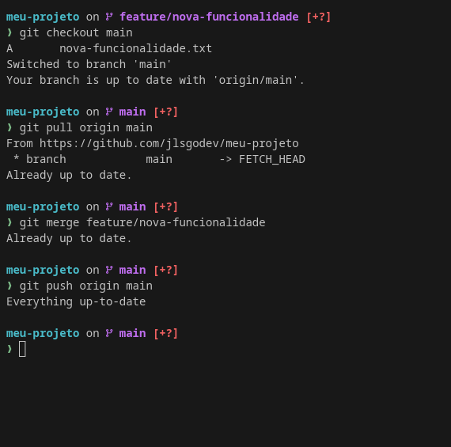

# Laboratório Prático - Git e GitHub

**Aluno:** Jhonn Lenon da Silva Gonçalves  
**Atividade:** AD2 - Laboratório Prático - Git e GitHub  
**Repositório:** meu-projeto  

---

## 1. Configuração inicial do Git

Nesta primeira etapa, foi verificada a configuração global do Git, onde ficam registrados o nome de usuário e o e-mail utilizados nos commits.

### Comandos utilizados

~~~bash
git config --list | grep user
~~~

### Print da execução

### Resposta

A configuração inicial do Git foi verificada com sucesso. O comando mostrou o nome de usuário e o e-mail configurados, que serão utilizados como identificação nos commits realizados no repositório.

---

## 2. Criação do repositório local

Nesta etapa, foi criada a pasta do projeto, a pasta para armazenar os prints e o repositório Git foi inicializado localmente.

### Comandos utilizados

~~~bash
mkdir meu-projeto
cd meu-projeto
mkdir img
git init
git branch -M main
git status
~~~

### Print da execução

### Resposta

O repositório local foi criado e inicializado com sucesso por meio do comando `git init`. Em seguida, a branch principal foi definida como `main`. O comando `git status` mostrou que o repositório ainda não possuía commits e que havia arquivos não rastreados.

---

## 3. Criação do arquivo README.md

Nesta etapa, foi criado o arquivo `README.md`, que normalmente é utilizado para apresentar informações iniciais sobre o projeto.

### Comandos utilizados

~~~bash
echo "# Meu Projeto" > README.md
git status
~~~

### Print da execução

### Resposta

O arquivo `README.md` foi criado com sucesso. Ao executar o comando `git status`, o Git identificou o arquivo como não rastreado, indicando que ele ainda precisava ser adicionado à área de preparação antes do commit.

---

## 4. Primeiro commit

Nesta etapa, o arquivo `README.md` foi adicionado à área de preparação e, em seguida, foi realizado o primeiro commit do projeto.

### Comandos utilizados

~~~bash
git add README.md
git commit -m "Primeiro commit: adiciona README.md"
git status
~~~

### Print da execução

### Resposta

O primeiro commit foi realizado com sucesso. O arquivo `README.md` passou a fazer parte do histórico do repositório Git local, registrando a primeira versão do projeto.

---

## 5. Criação do repositório no GitHub

Nesta etapa, foi criado um novo repositório público no GitHub com o nome `meu-projeto`.

### Orientações realizadas

- Acessar o GitHub;
- Criar um novo repositório;
- Nomear o repositório como `meu-projeto`;
- Deixar o repositório público;
- Não adicionar README, `.gitignore` ou licença durante a criação.

### Print da criação no GitHub

### Resposta

O repositório remoto foi criado com sucesso no GitHub. Após a criação, o GitHub disponibilizou a URL do repositório, que foi utilizada para conectar o projeto local ao repositório remoto.

---

## 6. Conexão do repositório local ao GitHub

Nesta etapa, o repositório local foi conectado ao repositório remoto do GitHub por meio do comando `git remote add origin`. Em seguida, a branch `main` foi enviada para o GitHub.

### Comandos utilizados

~~~bash
git remote add origin https://github.com/jlsgodev/meu-projeto.git
git remote -v
git push -u origin main
~~~

### Print da execução

### Resposta

O repositório local foi conectado ao GitHub com sucesso. O comando `git push -u origin main` enviou os commits da branch `main` para o repositório remoto, deixando o projeto disponível no GitHub.

---

## 7. Criação de uma nova branch

Nesta etapa, foi criada uma nova branch chamada `feature/nova-funcionalidade`, simulando o desenvolvimento de uma nova funcionalidade em uma linha separada da branch principal.

### Comandos utilizados

~~~bash
git checkout -b feature/nova-funcionalidade
echo "Nova funcionalidade em desenvolvimento" > nova-funcionalidade.txt
git status
~~~

### Print da execução

### Resposta

A branch `feature/nova-funcionalidade` foi criada com sucesso. O arquivo `nova-funcionalidade.txt` também foi criado nessa branch e apareceu no status do Git como um arquivo novo ainda não rastreado.

---

## 8. Commit da nova funcionalidade

Nesta etapa, o arquivo `nova-funcionalidade.txt` foi adicionado à área de preparação e registrado em um commit dentro da branch de funcionalidade.

### Comandos utilizados

~~~bash
git add nova-funcionalidade.txt
git commit -m "Adiciona nova funcionalidade"
git status
~~~

### Print da execução

### Resposta

O commit da nova funcionalidade foi realizado com sucesso. Dessa forma, o arquivo `nova-funcionalidade.txt` passou a fazer parte do histórico da branch `feature/nova-funcionalidade`.

---

## 9. Envio da branch para o GitHub

Nesta etapa, a branch `feature/nova-funcionalidade` foi enviada para o repositório remoto no GitHub.

### Comando utilizado

~~~bash
git push -u origin feature/nova-funcionalidade
~~~

### Print da execução

### Resposta

A branch `feature/nova-funcionalidade` foi enviada com sucesso para o GitHub. Com isso, a ramificação criada localmente também passou a existir no repositório remoto.

---

## 10. Merge da branch na main

Nesta etapa, foi realizado o merge da branch `feature/nova-funcionalidade` na branch principal `main`.

### Comandos utilizados

~~~bash
git checkout main
git pull origin main
git merge feature/nova-funcionalidade
git push origin main
~~~

### Print da execução

### Resposta

A branch de funcionalidade foi mesclada com sucesso na branch `main`. Após o merge, o arquivo `nova-funcionalidade.txt` passou a fazer parte da branch principal. Em seguida, as alterações foram enviadas ao GitHub com o comando `git push origin main`.

---

## Resumo do laboratório

Neste laboratório prático, foram exercitadas as principais funcionalidades do Git e do GitHub, incluindo:

- Configuração inicial do Git;
- Criação de repositório local;
- Criação de arquivos;
- Verificação do status do repositório;
- Adição de arquivos à área de preparação;
- Criação de commits;
- Criação de repositório remoto no GitHub;
- Conexão entre repositório local e remoto;
- Envio de commits com `git push`;
- Criação de branch;
- Desenvolvimento em uma branch separada;
- Envio da branch para o GitHub;
- Merge da branch de funcionalidade na branch principal.

Com isso, foi possível simular um fluxo básico de trabalho utilizado em projetos reais de desenvolvimento de software com Git e GitHub.

---

## Link do repositório

https://github.com/jlsgodev/meu-projeto
